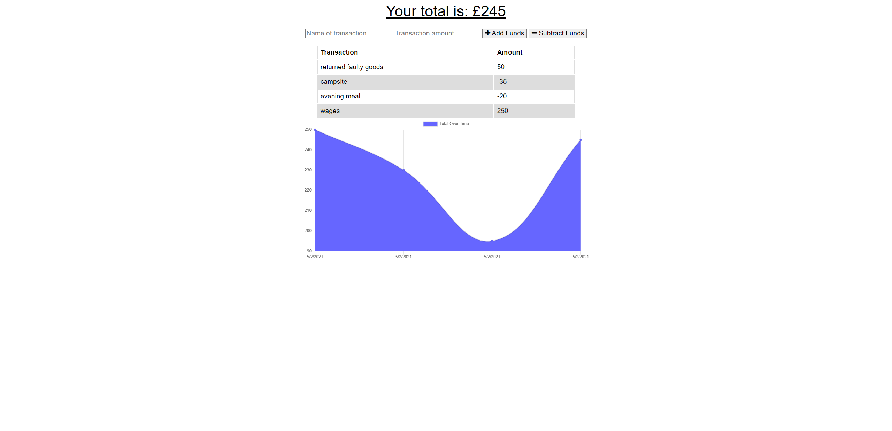

# Offline Budget Tracker  

## Description

An application that allows a user to track their incoming and outgoings.  It is designed so that should the internet connection be interrupted then they can still log their transactions, and the database will automatically be updated once internet connection is resumed. 

## Table of Contents

  - [Offline Budget Tracker](#Offline-Budget-Tracker)
  - [Description](##description)
  - [Table of Contents](##table-of-contents)
  - [Installation](##installation)
  - [Usage](##usage)
  - [License](##license)
  - [Contributors](##contributors)
  - [Technologies Used](##technologies-used)
  - [Future versions](##future-versions)

## Installation

It can be run locally from the github repository, once packages are installed and the database is created and seeded from the enclosed seed files and schema.  It is also deployed live at heroku. 

## Usage

The live deployed site is found at: https://pacific-gorge-99762.herokuapp.com/

A screenshot of the tracker app

A screenshot of the data being stored in pending in IndexedDB

## License

License with MIT

## Contributors

This app is the sole work of [Claire Davies](https://github.com/ClaireMDavies)

## Technologies Used

- Javascript
- node.js
- mongoose
- heroku
- express
- HTML
- CSS
- Bootstrap
- mongoDB Atlas
- morgan
- Robo3T
- Compression npm
- IndexedDB

## Future Versions

This is a pretty basic version of a budget tracker.  To increase it's useablity, I would look at consolidating data so that reports could be returned to track trends over a period of time for example, budget trends for a week/month/year, surplus funds, or alerts if getting within x number of £'s of no funds.  
  